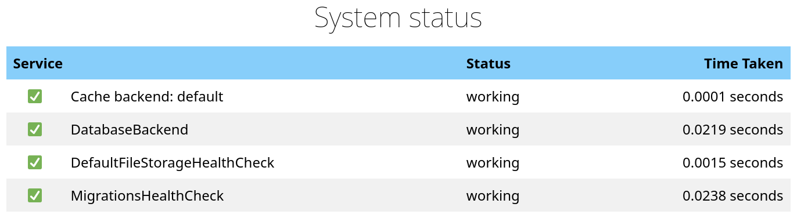
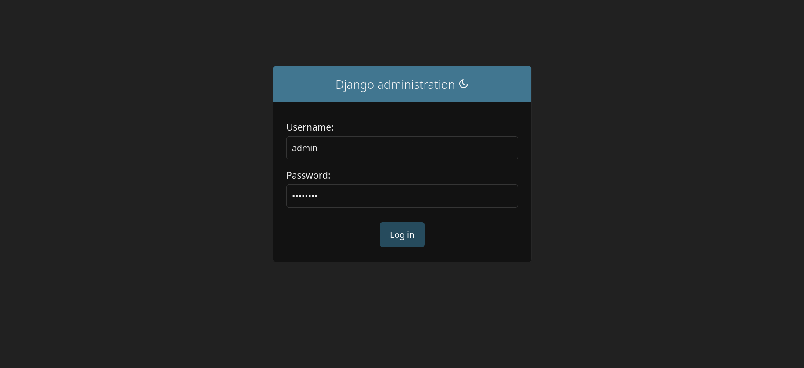
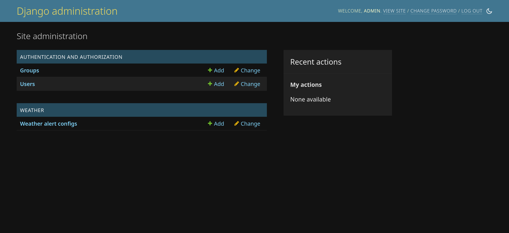

# 00 Prerequisites

Today we're going to be writing code in Python and versioning it in Git. To get
your environment ready let's install those dependencies and check out the lab
code. Here's a checklist of what we're going to do:

- Install Git
- Install Python 3.8+
- Set up lab environment

If you get stuck, ask for help!

## Confirm Git installation

There's a good chance you already have Git installed. See with:

=== "macOS / Linux"

    ```shell
    # In Terminal.app
    git --version  # macOS may prompt you to install command line developer tools.
    ```

=== "Windows"

    ```shell
    # In PowerShell
    git --version
    ```

If you get something along the lines of _command not found_, then let's install
it:

- macOS - If `git` was missing above, then macOS should have already prompted
  you to install _command line developer tools_.
- [Windows](https://git-scm.com/download/win) - Install Git from the official
  website.

If you're running Linux, then I assume you know the right package management
commands to install Git.

## Confirm Python installation

You're going to need at least Python 3.8 for this lab. Run the following and
confirm whether you have that version installed:

=== "macOS / Linux"

    ```shell
    # In Terminal.app
    python3 --version  # should output at least 3.8
    ```

=== "Windows"

    ```shell
    # In PowerShell
    python --version  # should output at least 3.8
    ```

!!! note

    Some systems will alias `python` to `python3`, but macOS's bundled
    interpreter does not. Once we set up a virtual environment below, we'll use
    `python` to refer to the virtual environment's interpreter.

If you do not already have a Python interpreter on your system, then refer to
the instructions for your operating system below:

- [macOS](https://docs.python.org/3/using/mac.html)
    - Make sure `/usr/local/bin` is in your `$PATH`.
    - If it is not, then open `~/.zshrc` and add the following line:
      `export PATH=/usr/local/bin:$PATH`.
- [Windows](https://docs.python.org/3/using/windows.html#windows-store)
    - The easiest way to install Python on Windows is through the Microsoft Store.

## Set up lab environment

### Clone repo and install dependencies

Tie the above together to get our lab environment ready.

=== "macOS / Linux"

    ```shell
    # clone the repo and enter it
    git clone https://github.com/johnjameswhitman/hackduke2023backend.git
    cd hackduke2023backend

    # set up virtual environment to isolate dependencies
    python -m venv venv
    source venv/bin/activate
    python -m pip install -r requirements/development.txt

    # run tests
    pytest weather/tests  # should all pass
    ```

=== "Windows"

    ```powershell
    # clone the repo and enter it
    git clone https://github.com/johnjameswhitman/hackduke2023backend.git
    cd hackduke2023backend

    # set up virtual environment to isolate dependencies
    python -m venv venv
    venv\Scripts\Activate.ps1
    python -m pip install -r requirements\devevelopment.txt

    # run tests
    pytest weather\tests  # should all pass
    ```

At this point tests should all be passing. If you see a warning about _The 
DEFAULT_FILE_STORAGE setting is deprecated_ it's ok to ignore.

### Fire up API

Now that you've gotten all of your dependencies set up, let's actually see 
the API in action.

```shell
# run migrations to set up the database
python manage.py migrate

# start the API in development mode
python manage.py runserver
```

You should see all :white_check_mark: when you load the API at:
[http://127.0.0.1:8000/status/](http://127.0.0.1:8000/status/).



!!! warning

    If you see :x: next to the _DatabaseBackend_ or _MigrationsHealthCheck_, 
    then this probably means you forgot to run migrations above before 
    starting the server (`python manage.py migrate`).

You can exit the server from your shell by pressing `CTRL+C`.

### Create local super-user

Django comes with user-management and a permissions framework out of the box. 
Let's create a local super-user for your API, and make sure we can log into 
the admin panel.

```shell
# Create a super-user and set a password.
python manage.py createsuperuser --email admin@example.com --username admin
```

!!! note

    Since this is your development environment it's ok to use a basic password
    you won't forget; however, if you do forget it you can reset it with the 
    command `python manage.py changepassword admin`. 

### Log into Django admin

Django also comes with an admin panel out of the box. Let's try it out.

```shell
# Start the server again
python manage.py runserver
```

Now, open the admin page in your browser:
[http://127.0.0.1:8000/admin/](http://127.0.0.1:8000/admin/).



Enter the credentials for your super-user and log in. You should see the admin
home screen with links to _Groups_ and _Users_, as well as the _Weather 
alert configs_ we'll be working with later in the workshop. You can use _admin_
to create new users, manage permissions, and work with models.


