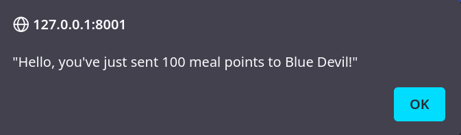

# 02 CORS Demo

## Intro

The idea behind CORS is to guard your API against unauthorized requests from 
third party sites. For example, banks want to prevent random websites from using
the bank's API to steal customer funds by issuing a request with javascript
while the customer is on the malicious website but logged into their bank from
a different tab.

All browsers respect a special `access-control-allow-origin` header that your
API sends back in responses. This provides a list of allowed _origins_, which 
are the combination of `protocol://domain:port`.


The API configures that header within
[`config/settings.py`](https://github.com/johnjameswhitman/hackduke2023backend/blob/0f05f07e08af798ea1aea85a10734f5433dee29c/config/settings.py#L31-L33)
as follows:

```
CORS_ALLOWED_ORIGINS = [
    "http://127.0.0.1:8001",  # Local docs site
]
```

So, if you wanted to allow AJAX (i.e. javascript) requests from a React.js 
front-end hosted on a different origin than your API, you would need to add 
that to your project's settings.

## Setup

Let's demo CORS with the local API. It will only work if you're viewing this page
from a development mkdocs server running from an origin of
`http://127.0.0.1:8001`...

- You're currently viewing this page from the origin: <pre id="corsDemoLocation">thinking...</pre>
- Therefore, the API will <b id="corsDemoAccept">thinking...</b> your 
  request.

From the root of the repository run `mkdocs serve`, and it will start serving
this documentation site from your local machine.

If you don't already have the API running locally, open up another shell and run:
`python manage.py runserver`.

## Demo

Below is a form that'll transfer some "meal points" using a dummy endpoint in 
the API. Let's try it from two different _origins_. Open each of these links in
different tabs and then click _Transfer_ below:

- [`http://127.0.0.1:8001/lab/02_security/`](http://127.0.0.1:8001/lab/02_security/#demo)
- [`http://localhost:8001/lab/02_security/`](http://localhost:8001/lab/02_security/#demo)

!!! Note

    `127.0.0.1` and `localhost` are both addresses that point back to your 
    local machine; however, because they're different domains each address 
    represents a different _origin_.

### Transfer "meal points"

<form>
  <input id="corsDemoInputAmount" class="md-input" placeholder="Points" value="100"/>
  <input id="corsDemoInputDestination" class="md-input" placeholder="Who" value="Blue Devil"/>
  <button id="corsDemoButton" class="md-button md-button--primary" type="button">Transfer</button>
</form>

If you submit the above for from an allowed origin, then you should get an 
alert:



But, if you submit it from a disallowed origin, then you'll get an error and 
should see something like below in your browser console:


<script>
  (() => {
    let httpRequest;
    document
      .getElementById("corsDemoButton")
      .addEventListener("click", makeRequest);

    function makeRequest() {
      httpRequest = new XMLHttpRequest();

      if (!httpRequest) {
        alert("Giving up :( Cannot create an XMLHTTP instance");
        return false;
      }
      httpRequest.addEventListener("load", transferComplete);
      httpRequest.addEventListener("error", transferFailed);
      httpRequest.open("POST", "http://127.0.0.1:8000/api/auth/cors_demo");
      httpRequest.setRequestHeader("Content-Type", "application/json; charset=UTF-8");
      httpRequest.send(
        JSON.stringify(
          {
            "amount": document.getElementById("corsDemoInputAmount").value, 
            "destination": document.getElementById("corsDemoInputDestination").value,
          }
        )
      );
    }

    function transferComplete(evt) {
      alert(evt.target.responseText);
    }

    function transferFailed(evt) {
      alert("Request failed! CORS issue?");
    }

    function locationCorsApproved() {
      const allowedOrigin = /^http:\/\/127\.0\.0\.1:8001\//;
      document.getElementById("corsDemoLocation").innerText = `${window.location.protocol}//${window.location.host}`;
      if (allowedOrigin.test(window.location)) {
        document.getElementById("corsDemoAccept").innerText = "accept ✅";
      } else {
        document.getElementById("corsDemoAccept").innerText = "reject ❌";
      }
    }

    locationCorsApproved();
  })();
</script>
