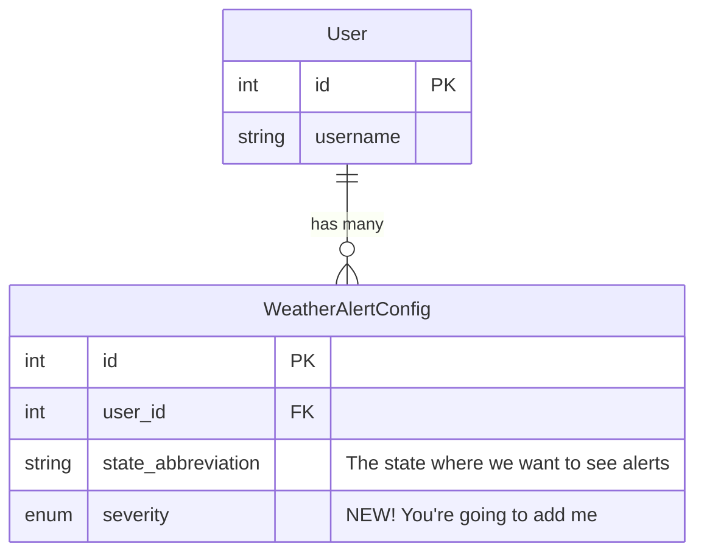
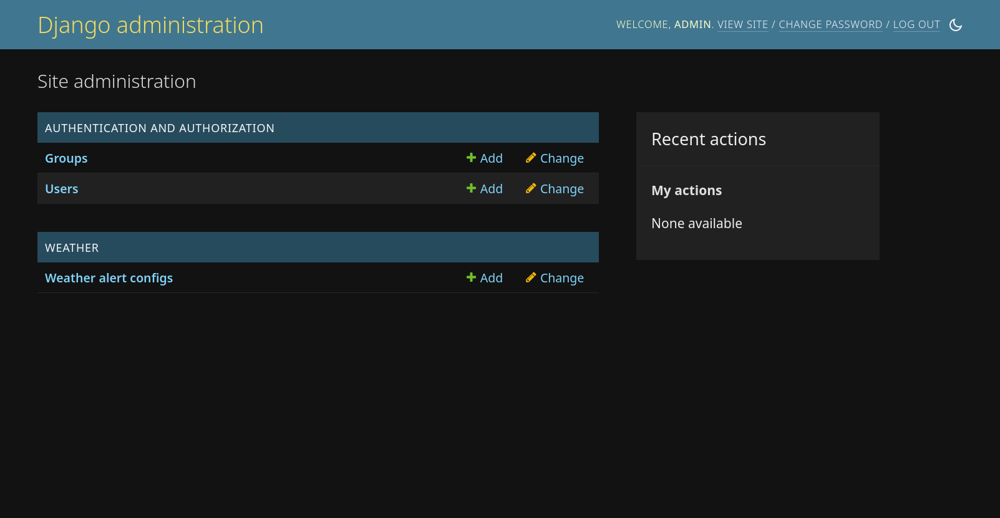
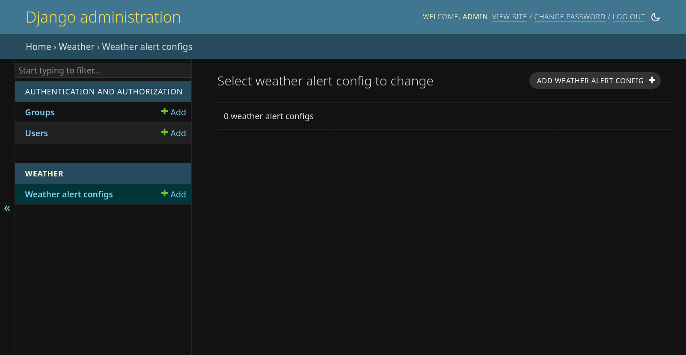
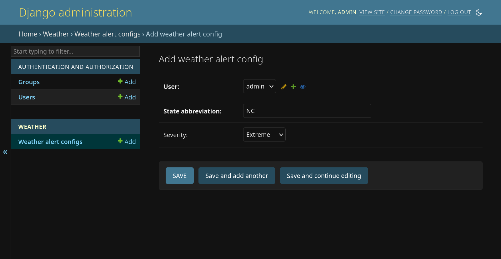

# 03 Data Modeling

## Goals

In this lab we are going to:

- Gain an understanding of how Django's Object Relational Mapper works
- Modify the data model
- Create some data with Django Admin

## Entity relationships

When building an API it's important to get your data model right early on. 
Unwinding mistakes down the road is difficult. Because it's hard to theorize 
an entire problem space, start small and iterate as you learn more.

For our API we have a simple data model that lets _users configure weather 
alerts_.



A couple of notes on the diagram:

- Each _entity_ has an `id` field that represents its _primary key_. Django will 
  automatically assign this to every model you create.
- `WeatherAlertConfig` has a `user_id` _foreign key_ that points back to the 
  owning `User`. This forms a many-to-one relationship.

Our job today will be to add the new `severity` field to the
`WeatherAlertConfig`. 

## Mapping database records to Python objects

Django comes with an Object Relational Mapper ([docs][orm_docs]). It allows 
us to _model_ database tables as Python objects, and then automatically generate
the necessary changes in the database to store data.

Let's look at the model for our `WeatherAlertConfig` entity, which lives in 
[`weather/models.py`][weather_models].

```python
class WeatherAlertConfig(models.Model):
    """Configuration for an alert that a user is interested in."""

    user = models.ForeignKey(User, on_delete=models.CASCADE)
    state_abbreviation = models.CharField(max_length=2)
    # TODO: below we'll add severity!
```

This model maps onto the entity diagram above. A couple of things to note:

- `user` is a `ForeignKey` onto the `User` model. Django will automatically 
  create the underlying `user_id` foreign key in the table, and will make the 
  related `User` object available at this property on instances of the model.
- We don't need to specify an `id` primary key, because the underlying 
  `models.Model` base-class adds it for us.
- Use descriptive names for your fields. For example, `state` may be 
  confusing because it's not clear whether it's the full-state, or just the 
  two-letter `state_abbreviation` like we've indicated.

[orm_docs]: https://docs.djangoproject.com/en/4.2/topics/db/models/
[weather_models]: https://github.com/johnjameswhitman/hackduke2023backend/blob/04994ecc88fb764bc731e2b34fc2b3551eb20d03/weather/models.py#L5-L9

## Tweak the model and migrate

Right now, our users can tell the API which states they're interested in
getting weather alerts for, but the National Weather Service API that we rely 
upon offers a few more things we can use to filter alerts. To see what's 
available go to the [_NWS API docs_][nws_alerts_docs] > Specification > 
expand `GET /alerts`.

[nws_alerts_docs]: https://www.weather.gov/documentation/services-web-api#/default/alerts_query

After consulting with users, we've found out they would also like to include 
the `severity` field to avoid being inundated with low risk alerts. This is 
an `enum` field, which means it can hold one of a set number of values:

- `Extreme`
- `Severe`
- `Moderate`
- `Minor`
- `Unknown`

### Add `severity` field

Let's wire this new `severity` field into the model.

1. Open [`weather/models.py`][weather_models].
2. Add a new class above `WeatherAlertConfig` with the following:
    ```python
    class Severity(models.IntegerChoices):
        EXTREME = "Extreme"
        SEVERE = "Severe"
        MODERATE = "Moderate"
        MINOR = "Minor"
        UNKNOWN = "Unknown"
    ```
3. Now, add a new field to the `WeatherAlertConfig` model that maps the _text 
   choices_ to a column in the database:
    ```python
    severity = models.CharField(
        max_lenth=10,
        choices=Severity.choices,
        # Below options allow users to omit a severity if they want everything.
        blank=True,
        null=True,
    )
    ```

Afterward, `weather/models.py` should look similar to below:

```python
from django.contrib.auth.models import User
from django.db import models


class Severity(models.TextChoices):
    EXTREME = "Extreme"
    SEVERE = "Severe"
    MODERATE = "Moderate"
    MINOR = "Minor"
    UNKNOWN = "Unknown"


class WeatherAlertConfig(models.Model):
    """Configuration for an alert that a user is interested in."""

    user = models.ForeignKey(User, on_delete=models.CASCADE)
    state_abbreviation = models.CharField(max_length=2)
    severity = models.CharField(
        max_length=10,
        choices=Severity.choices,
        # Below options allow users to omit a severity if they want everything.
        blank=True,
        null=True,
    )
```

### Migrate changes

At this point we've made changes to our data model, but need to reflect those 
changes into the database. This is where _migrations_ come into play. Django 
will inspect your models and the current structure of the database, then 
generate a migration that closes any gaps between the two. To do this we'll use
management commands with Django.

```shell
python manage.py makemigrations  # sees gap between weather/models.py and tables
python manage.py migrate  # applies changes
```

## Django Admin

Now that we've modeled our changes and applied them to the database, let's 
see what it looks like:

1. Fire up your local development server: `python manage.py runserver`
2. Navigate to Django Admin: [http://127.0.0.1:8000/admin](http://127.0.0.1:8000/admin)
3. Log in with your superuser (admin) if necessary

    

4. Click on [_Weather alert configs_](http://127.0.0.1:8000/admin/weather/weatheralertconfig/)
5. Click on _ADD WEATHER ALERT CONFIG_

    

6. Populate and save the alert

    

