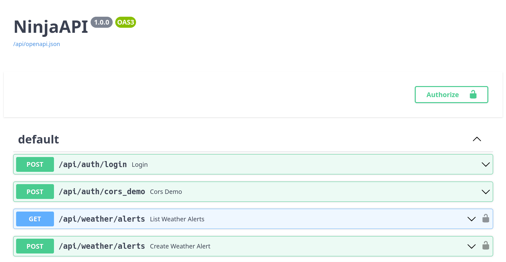

# 04 API Endpoints

## Goals

Today we're going to learn how to:

- Interact with our API
- Authenticate requests
- Modify endpoints

This lab will also give you a quick overview of the _Django Ninja_ plugin 
that we're using for the API. It provides simple _request deserialization_ 
and _response serialization_ using Python type annotations. For in depth info, 
consult the [Django Ninja docs](https://django-ninja.rest-framework.com/).

## API docs viewer

Django Ninja provides a documentation viewer out of the box that we can use 
to see the _shapes_ of API requests and responses, and interact with 
endpoints. Make sure you're running the API (`python manage.py runserver`), and 
then navigate to the following URL to view the docs:
[http://127.0.0.1:8000/api/docs](http://127.0.0.1:8000/api/docs).



### JWT authentication

Without going into too much detail, the API uses [JSON Web Tokens][wiki_jwt] to 
authenticate requests.

!!! Note

    If you're curious how the API enforces JWT authentication, check out 
    [`auth/backends.py`][auth_backends], [`config/urls.py`][config_urls] and the 
    [Django Ninja Auth docs][django_ninja_auth_docs].

In order to call endpoints you'll need to generate one using your superuser 
(admin) credentials you previously set up, and tell the docs site to use it.

[wiki_jwt]: https://en.wikipedia.org/wiki/JSON_Web_Token
[auth_backends]: https://github.com/johnjameswhitman/hackduke2023backend/blob/4c1fe45a26f903ccd471fe373f0d78f27f7f9c8b/auth/backends.py#L17-L35
[config_urls]: https://github.com/johnjameswhitman/hackduke2023backend/blob/4c1fe45a26f903ccd471fe373f0d78f27f7f9c8b/config/urls.py#L8
[django_ninja_auth_docs]: https://django-ninja.rest-framework.com/guides/authentication/

1. Click into the `POST /api/auth/login` endpoint in the docs, press _Try 
   it out_:

    

2. Populate your superuser username (admin) and password in the _Request 
   body_, then press _Execute_

    

3. Copy the JWT out of the _Response body_ > `access_token` field

    

4. Scroll back to the top of the page, click _Authorize_, and paste the 
   JWT into the text box that appears

    

5. Now you're ready to call the other endpoints. Scroll down and execute the 
   `GET /api/weather/alerts` endpoint. You should see the one you created in 
   Django Admin earlier

    

!!! Warning

    The docs site doesn't save your login info when you reload it. So, to save 
    some time it's a good idea paste your JWT into your notes for quick 
    reference. It will be good for 24 hours from the time you generate it.

## Working with endpoints

Now that we're set up to make calls to the API, let's learn some more about 
how to expose endpoints with Django Ninja.

### Routers and URLs

Two files you'll see in every Django project are `urls.py` and `views.py`. 
Django uses URLs to map URL paths to views that you've defined. Django _Ninja_
takes this a step further, and introduces the concept of a `Router` that handles
sub-paths for a corner of your API.

Consider this example from [`config/urls.py`][config_urls].

```python
from auth.views import router as auth_router
from weather.views import router as weather_router

api = NinjaAPI(auth=JWTAuthRequired())
api.add_router("/auth/", auth_router)
api.add_router("/weather/", weather_router)

urlpatterns = [
    path("status/", include("health_check.urls")),
    path("admin/", admin.site.urls),
    path("api/", api.urls),
]
```

It exposes our status page, admin page, and the API. But, it leaves routing 
anything under `api/` to Django Ninja. We've included two routers under the 
Ninja API that will handle requests to `/api/auth/` and `/api/weather/`.

[config_urls]: https://github.com/johnjameswhitman/hackduke2023backend/blob/831a26ad319a8a808d162712af368de1002997fa/config/urls.py#L8-L16

### Views and (de)serialization

Now that we have an idea of how Django configures `GET /api/weather/alerts`, 
how do we actually write the code that handles requests to that path? To see, 
checkout [`weather/views.py`][weather_views].

```python
router = Router()

@router.get("/alerts", response=list[WeatherAlertResponse])
def list_weather_alerts(request) -> list[WeatherAlertConfig]:
    return WeatherAlertConfig.objects.all()
```

Here we've created the `router` that we wired into Django Ninja above, and 
tell it that `GET` requests to `/alerts` (under `/api/weather`) should be 
handled by the `list_weather_alerts` function.

But, what does the function actually do? It loads all `WeatherAlertConfig` 
records from the database and returns them to the user. This is the same 
model that we modified in the prior lab.

Ok so, how does Django Ninja actually convert the model instances into JSON 
that the browser understands? This is part of the magic of Django Ninja. In 
the call to the `@router.get` decorator, we say the response will be a list 
of `WeatherAlertResponses`:

```python
class WeatherAlertResponse(ModelSchema):
    class Config:
        model = WeatherAlertConfig
        model_fields = "__all__"
```

Django Ninja provides a special `ModelSchema` class that we can inherit to 
define the _shape_ our requests and responses. In some cases you manually set 
the fields, but here we simply tell it to mirror the shape of our model. 
Django Ninja handles the rest.

[weather_views]: https://github.com/johnjameswhitman/hackduke2023backend/blob/831a26ad319a8a808d162712af368de1002997fa/weather/views.py#L24-L26

## Update the API

Now it's your turn to update the API. Let's handle the new `severity` field 
we added to `WeatherAlertConfig` in the last lab.

### Wire `severity` into endpoints

Within `weather/views.py`, notice that we have CRUD endpoints that line up 
with their corresponding HTTP methods. We'll need to make sure we handle the 
new `severity` field in these. 

The `WeatherAlertRequest` schema defines the shape of requests that modify 
a weather alert config. Add `severity` here so the API includes it when 
creating and updating alerts:

```python
from .models import Severity

class WeatherAlertRequest(Schema):
    state_abbreviation: str
    severity: Severity
```

Endpoints that rely on this schema will automatically have access to the new 
severity field when working with requests.

### Update `service` call

`services` are not a Django concept, but are a good place to drop complex 
business logic and interactions with third parties. For example, the API has a 
`NationalWeatherService` class in [`weather/services.py`][weather_services] 
that handles interactions with the NWS API. Let's get that working with the 
new `severity` field.

1. First, update `_get_alerts` to include the severity:

    ```python
    def _get_alerts(self, area: str, severity: str, limit: int) -> dict:
        """Fetches alerts from the NWS API."""
        res = requests.get(
            self.ALERTS_URL,
            params={"area": area, "severity": severity, "limit": limit},
        )
        res.raise_for_status()  # Raises error if API returned HTTP 4XX or 5XX status.
        return res.json()
    ```

2. Next, update the [cache key][weather_services_cache_key] we use to ensure the
   API caches repeated calls to the NWS API:

    ```python
    ALERTS_CACHE_KEY_TEMPLATE: str = f"{__name__}.alerts.{{area}}.{{severity}}.{{limit}}"
    ```

3. Finally, update the call to [fetch and cache][weather_services_fetch] the NWS 
   data:

    ```python
    alerts = cache.get_or_set(
        self.ALERTS_CACHE_KEY_TEMPLATE.format(
            area=config.state_abbreviation,
            severity=config.severity,  # Update here
            limit=limit,
        ),
        default=partial(
            self._get_alerts,
            area=config.state_abbreviation,
            severity=config.severity,  # And here
            limit=limit,
        ),
    )
    ```

Once you're done with the edits, `weather/services.py` should look something
like this:

```python
import logging
from enum import Enum
from functools import partial
from typing import Optional

import requests
from django.core.cache import cache
from ninja.schema import Schema

from .models import WeatherAlertConfig

logger = logging.getLogger(__name__)


class WeatherAlertStatus(str, Enum):
    ACTUAL = "Actual"
    EXERCISE = "Exercise"
    SYSTEM = "System"
    TEST = "Test"
    DRAFT = "Draft"


class WeatherAlertSeverity(str, Enum):
    EXTREME = "Extreme"
    SEVERE = "Severe"
    MODERATE = "Moderate"
    MINOR = "Minor"
    UNKNOWN = "Unknown"


class WeatherAlert(Schema):
    """Lightweight entity based on Alert from Weather API.

    For docs see Schemas > Alert: https://www.weather.gov/documentation/services-web-api
    """

    id: str
    status: WeatherAlertStatus
    severity: WeatherAlertSeverity
    headline: str
    description: str
    instruction: Optional[str]


class NationalWeatherService:
    """Utilities to retrieve data from the National Weather Service API.

    For docs see: https://www.weather.gov/documentation/services-web-api
    """

    ALERTS_URL: str = "https://api.weather.gov/alerts"
    ALERTS_CACHE_KEY_TEMPLATE: str = f"{__name__}.alerts.{{area}}.{{severity}}.{{limit}}"

    def _get_alerts(self, area: str, severity: str, limit: int) -> dict:
        """Fetches alerts from the NWS API."""
        res = requests.get(
            self.ALERTS_URL,
            params={"area": area, "severity": severity, "limit": limit},
        )
        res.raise_for_status()  # Raises error if API returned HTTP 4XX or 5XX status.
        return res.json()

    def get_alerts(
        self, config: WeatherAlertConfig, limit: int = 10
    ) -> list[WeatherAlert]:
        """Fetches alerts for a given WeatherAlertConfig."""
        alerts = cache.get_or_set(
            self.ALERTS_CACHE_KEY_TEMPLATE.format(
                area=config.state_abbreviation,
                severity=config.severity,  # Update here
                limit=limit,
            ),
            # default can be a value or a zero-argument callable. "partial" takes a callable
            # (self._get_alerts) and its arguments (anything, but "area" and "limit" in this case),
            # and returns a new callable. This defers execution of self._get_alerts with the
            # given arguments until partial's return-value itself is called.
            default=partial(
                self._get_alerts,
                area=config.state_abbreviation,
                severity=config.severity,  # And here
                limit=limit,
            ),
        )

        weather_alerts = []
        for alert_data in alerts.get("features", []):
            properties = alert_data["properties"]
            weather_alerts.append(
                WeatherAlert(
                    id=properties["id"],
                    status=WeatherAlertStatus(properties["status"]),
                    severity=WeatherAlertSeverity(properties["severity"]),
                    headline=properties["headline"],
                    description=properties["description"],
                    instruction=properties["instruction"],
                )
            )

        if weather_alerts:
            logger.debug("Found alerts.", extra={"count": len(weather_alerts)})
        else:
            logger.warning("Got no weather alerts!", extra={"area": config.state_abbreviation})

        return weather_alerts
```

[weather_services]: https://github.com/johnjameswhitman/hackduke2023backend/blob/234d647babba5e3dadbbb90edb6b4ba7046d5b3c/weather/services.py#L54-L61
[weather_services_cache_key]: https://github.com/johnjameswhitman/hackduke2023backend/blob/234d647babba5e3dadbbb90edb6b4ba7046d5b3c/weather/services.py#L52
[weather_services_fetch]: https://github.com/johnjameswhitman/hackduke2023backend/blob/234d647babba5e3dadbbb90edb6b4ba7046d5b3c/weather/services.py#L67-L78

### Call alerts endpoint

Let's confirm that our update worked. Go back to the API docs (
[http://127.0.0.1:8000/api/docs](http://127.0.0.1:8000/api/docs)). You may 
need to _Authorize_ again if you've reloaded the page.

1. Scroll down to `GET /api/weather/alerts/{weather_alert_config_id}`.
2. Click _Try it out_, and provide a `weather_alert_config_id` of _1_.
3. Observe that you get weather alerts for the severity you configured in 
   your model (e.g. _Extreme_).

    

